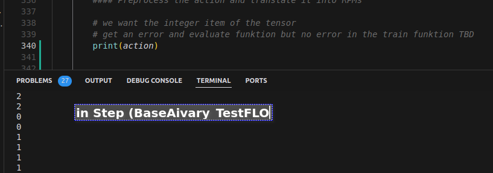

# Readme Flo: Erkenntnisse, Changes etc.

## 12.1.2025
### Goal

klären, wieso die Drohne nicht bei 0,5 m hovert.

### Progress

- Programm mit learn.py verglichen und dann auch die BaseRLAviary mit BaseRLAviary_TestFlo verglichen
- Viel auf, dass nachdem ich ein Plotting für die Action/Observeration space von learn.py einkopiert habe, dass das Obsevervation-Space nicht correkt war und nicht die 21 werte übernommen hat, sonder 21 als Wert für die erste Obeservation fix ausgegeben hat --> Algorithmus wusste nichts.
- hier gab es probleme mit den Dimensionen (1,21) erwartet, es war aber 21,0 aufgrund des h.stacks -> ersetzt durch:
>
    obs_21 = np.concatenate([
    obs[0:3],    # Position x,y,z
    obs[7:10],   # Roll, pitch, yaw
    obs[10:13],  # Linear velocity
    obs[13:16],  # Angular velocity  
    obs[16:20],  # Last clipped action
    obs[20:25]   # Raycast readings
    ])

- weiterhin nicht auf 0,5 gehovert, es passiet aber auch nicht in x,y,z (an den Rendern sehbar) 

>[INFO] BaseAviary.render() ——— it 0005 ——— wall-clock time 0.3s, simulation time 0.0s@240Hz (0.06x)
[INFO] BaseAviary.render() ——— drone 0 ——— x +00.00, y +00.00, z +00.50 ——— velocity +00.00, +00.00, -00.20 ——— roll +00.00, pitch -00.00, yaw +00.00 ——— angular velocity +0.0000, +0.0000, +0.0000 ——— 

- Raycast dem Render hinzugefügt

>——— raycast front +2.4500, raycast back +2.4500, raycast left +2.4500, raycast right +2.4500, raycast top +9999.0000 ——— 

- Untersucht, welche Actions der Algorithmus auswählt: wählt sehr unterschiedliche Sache aus und wählt oft -> Problem mit dem Abstürzen ist also essentiell zu lösen (baseAviary_FlytotheWAll)
{width=50%}

inital XYZs direkt wie im MS_PID-FIle gemacht, aber keine Verbesserung:
{width=50%} -->{width=50%}

- Weil nichts geklappt hat, habe ich die learn.py kopiert und die BaseRLAviary_TestFlytoWall angewendet. Es lernt etwas, aber es gibt folgende Probleme:
    - wenn vorwärts an die Wand geflogen wird, wird die Env. nicht sauber zurückgesetzt
    - PPO addiert immer den ganzen Reward auf, dadurch wird der Reward viel größer als wir wollen